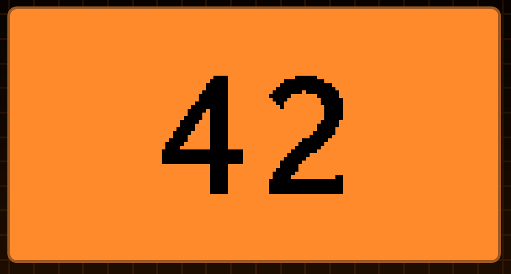

# FlipperZero Counter

The simple app for the [Flipper Zero](https://www.flipperzero.one).
Provide a counter which you can increment and decrement by using the up and down buttons.

## Buttons

- UP, OK - increase counter
- Down - decrease counter
- Hold OK - enable/disable vibration
- Hold Back - reset counter
- Back - exit

Tested on:

- [Unleashed](https://github.com/DarkFlippers/unleashed-firmware)

## Source

Based on the [dolphin-counter](https://github.com/Krulknul/dolphin-counter)

Changes:

- Increased font size
- Removed decorations
- Decreased counter max value to 9999 (original: 99999)
- Added max/min value notification (vibro, light)

## TODO:

- Fix font (artifacts)
